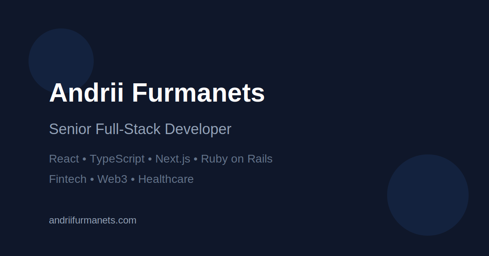

# Andrii Furmanets - Personal Website

A modern, responsive personal portfolio website built with Next.js, TypeScript, and Tailwind CSS. This website showcases my skills, experience, and projects as a Senior Full-Stack Developer specializing in React, TypeScript, Next.js, and Ruby on Rails.



## 🚀 Live Demo

Visit the live website at [andriifurmanets.com](https://andriifurmanets.com)

## ✨ Features

- **Responsive Design**: Optimized for all device sizes from mobile to desktop
- **Dark/Light Mode**: Theme toggle with system preference detection
- **Modern UI**: Clean, professional design with smooth animations
- **SEO Optimized**: Comprehensive metadata, structured data, and OpenGraph images
- **Mobile-First Navigation**: Hamburger menu for mobile with smooth transitions
- **Interactive Sections**: About, Experience, Skills, Education, and Contact
- **Contact Form**: Email integration for direct communication
- **Optimized Performance**: Fast loading times and efficient rendering

## 🛠️ Tech Stack

- **Framework**: [Next.js 15](https://nextjs.org/) with App Router
- **Language**: [TypeScript](https://www.typescriptlang.org/)
- **Styling**: [Tailwind CSS](https://tailwindcss.com/)
- **Animations**: [Framer Motion](https://www.framer.com/motion/)
- **Icons**: [Lucide React](https://lucide.dev/) and [React Icons](https://react-icons.github.io/react-icons/)
- **Form Handling**: [React Hook Form](https://react-hook-form.com/) with [Zod](https://github.com/colinhacks/zod)
- **Email Integration**: [EmailJS](https://www.emailjs.com/)
- **Theming**: [next-themes](https://github.com/pacocoursey/next-themes)
- **SEO**: Next.js Metadata API, next-sitemap

## 📂 Project Structure

```
personal-website/
├── public/               # Static assets
│   ├── icons/            # Technology icons
│   ├── logos/            # Logo files
│   └── og-image.svg      # OpenGraph image
├── src/
│   ├── app/              # Next.js App Router
│   │   ├── layout.tsx    # Root layout with metadata
│   │   ├── page.tsx      # Home page
│   │   └── globals.css   # Global styles
│   ├── components/       # React components
│   │   ├── sections/     # Page sections (Hero, About, etc.)
│   │   └── ui/           # Reusable UI components
│   └── lib/              # Utility functions and hooks
├── tailwind.config.js    # Tailwind configuration
├── next.config.js        # Next.js configuration
└── package.json          # Dependencies and scripts
```

## 🚀 Getting Started

### Prerequisites

- Node.js 18.17.0 or later
- npm or yarn

### Installation

1. Clone the repository:

   ```bash
   git clone https://github.com/afurm/personal-website.git
   cd personal-website
   ```

2. Install dependencies:

   ```bash
   npm install
   # or
   yarn install
   ```

3. Run the development server:

   ```bash
   npm run dev
   # or
   yarn dev
   ```

4. Open [http://localhost:3000](http://localhost:3000) in your browser to see the result.

## 🔧 Configuration

### Environment Variables

Create a `.env.local` file in the root directory with the following variables:

```
# EmailJS Configuration
NEXT_PUBLIC_EMAILJS_SERVICE_ID=your_service_id
NEXT_PUBLIC_EMAILJS_TEMPLATE_ID=your_template_id
NEXT_PUBLIC_EMAILJS_USER_ID=your_user_id
```

### Contact Form

The contact form uses EmailJS for sending emails. You'll need to:

1. Create an account at [EmailJS](https://www.emailjs.com/)
2. Create a service and email template
3. Update the environment variables with your credentials

### Favicon Setup

The website includes comprehensive favicon support for various devices and browsers. To properly set up the favicon:

1. Generate favicon files using the SVG templates in the `public` directory:

   - `favicon.svg` - Vector version of the favicon
   - `favicon-large.svg` - Larger vector version for generating different sizes

2. You'll need to create the following files (you can use an online favicon generator like [RealFaviconGenerator](https://realfavicongenerator.net/)):

   - `favicon.ico` - Multi-size ICO file (16x16, 32x32, 48x48)
   - `favicon-16x16.png` - 16x16 PNG favicon
   - `favicon-32x32.png` - 32x32 PNG favicon
   - `apple-touch-icon.png` - 180x180 PNG for iOS devices
   - `android-chrome-192x192.png` - 192x192 PNG for Android devices
   - `android-chrome-512x512.png` - 512x512 PNG for Android devices

3. The `site.webmanifest` file is already configured to reference these icons for PWA support.

## 📱 Mobile Optimization

The website is fully responsive with special considerations for mobile users:

- Hamburger menu for navigation
- Vertically stacked buttons in the hero section
- Optimized tech stack display
- Custom theme toggle in mobile menu

## 🔍 SEO Optimization

This website implements several SEO best practices:

- Comprehensive metadata in `layout.tsx`
- OpenGraph and Twitter card images
- Structured data with Schema.org markup
- Automatically generated sitemap and robots.txt
- Proper heading hierarchy
- Semantic HTML structure

## 🚢 Deployment

### Build for Production

```bash
npm run build
# or
yarn build
```

This will create an optimized production build and generate the sitemap.

### Deployment Platforms

The site can be easily deployed to:

- [Vercel](https://vercel.com/) (recommended for Next.js)
- [Netlify](https://www.netlify.com/)
- [AWS Amplify](https://aws.amazon.com/amplify/)

## 🧩 Customization

### Changing Content

Most content is stored in the component files under `src/components/sections/`. Update these files to change the information displayed on the website.

### Styling

The website uses Tailwind CSS for styling. Customize the design by modifying:

- `tailwind.config.js` for theme colors and extensions
- Component-level classes for specific styling

## 📄 License

This project is licensed under the MIT License - see the LICENSE file for details.

## 👨‍💻 Author

**Andrii Furmanets** - Senior Full-Stack Developer

- [GitHub](https://github.com/afurm)
- [LinkedIn](https://linkedin.com/in/andrii-furmanets-1a5b6452/)
- [Website](https://andriifurmanets.com)

---

Built with ❤️ using Next.js and React

## Telegram Bot Setup for Contact Form

The contact form on this website sends submissions to a Telegram bot. Follow these steps to set it up correctly:

1. **Create a Telegram bot**:

   - Message [@BotFather](https://t.me/botfather) on Telegram
   - Use the `/newbot` command and follow the instructions
   - BotFather will give you a bot token - copy this for the next step

2. **Get your chat ID**:

   - Message [@userinfobot](https://t.me/userinfobot) on Telegram
   - It will reply with your user information, including your ID
   - Copy your ID (a number like 434334343)

3. **Configure environment variables**:

   - Create a `.env.local` file in the root directory with the following:

   ```
   TELEGRAM_BOT_TOKEN=your_bot_token_here
   TELEGRAM_CHAT_ID=your_chat_id_here
   ```

   - Replace the placeholder values with your actual bot token and chat ID

4. **Important: Start a conversation with your bot**:

   - Find your bot on Telegram (by the username you gave it)
   - Send it a message (like "/start")
   - This step is crucial - your bot can only send messages to users who have initiated a conversation with it

5. **Test the connection**:

   - After starting your development server, visit `/api/telegram-test` in your browser
   - This will send a test message to your Telegram account
   - If successful, you'll receive a message on Telegram and see a success response in the browser
   - If it fails, check the error message and make sure you've completed step 4

6. **Restart the development server**:
   ```bash
   npm run dev
   # or
   yarn dev
   ```

Now when someone submits the contact form, you'll receive a notification in Telegram with their name, email, and message.

### Troubleshooting Telegram Bot

If you're experiencing issues with the Telegram integration:

1. **"Chat not found" error**:

   - Make sure you've started a conversation with your bot
   - Verify that the chat ID in `.env.local` matches your Telegram user ID

2. **No messages being received**:

   - Check that your bot token is correct
   - Ensure your development server is running
   - Try the test endpoint at `/api/telegram-test`

3. **Bot stopped working**:
   - Telegram bot tokens can expire if you regenerate them
   - If you created a new token, update it in `.env.local`

## 📝 Blog System

This website includes a blog system that uses Markdown files to generate blog posts. Here's how to create and format blog posts:

### Blog Post Structure

Blog posts are stored as Markdown files in the `blogs/` directory. Each file must include:

1. **Front Matter**: YAML metadata at the top of the file between triple dashes (`---`)
2. **Content**: The main body of the blog post in Markdown format

### File Naming and Location

- Create your Markdown files directly in the `blogs/` directory
- The filename should ideally match or relate to the slug (e.g., `getting-started-with-nextjs.md`)
- The system will automatically process all `.md` files in this directory

### Required Front Matter Fields

Each blog post must include the following front matter fields:

```md
---
title: "Your Blog Post Title"
description: "A brief description for SEO and previews (150-160 characters recommended)"
date: "YYYY-MM-DD"
tags: ["tag1", "tag2", "tag3"]
slug: "your-blog-post-slug"
---
```

- **title**: The title of your blog post
- **description**: A brief summary for SEO and previews (150-160 characters recommended)
- **date**: Publication date in YYYY-MM-DD format
- **tags**: An array of relevant tags (used for categorization and filtering)
- **slug**: The URL-friendly identifier for the post (used in the URL path)

### Content Formatting

The blog content uses standard Markdown syntax:

- **Headings**: Use `#` for h1, `##` for h2, etc.
- **Emphasis**: Use `*italic*` for *italic* and `**bold**` for **bold**
- **Lists**: Use `- ` for unordered lists and `1. ` for ordered lists
- **Links**: Use `[link text](URL)`
- **Images**: Use ``
- **Code blocks**: Use triple backticks with optional language identifier:

  ```javascript
  // JavaScript code example
  function hello() {
    console.log("Hello, world!");
  }
  ```

### Example Blog Post

```md
---
title: "Getting Started with Next.js"
description: "Learn how to build modern web applications with Next.js"
date: "2024-03-01"
tags: ["nextjs", "react", "web-development"]
slug: "getting-started-with-nextjs"
---

# Getting Started with Next.js

Next.js is a powerful React framework that enables you to build server-side rendered and statically generated web applications with ease.

## Why Next.js?

Next.js provides several key features that make it an excellent choice for modern web development:

1. **Server-side rendering (SSR)** - Improves performance and SEO
2. **Static site generation (SSG)** - Pre-renders pages at build time for optimal performance

## Code Example

```jsx
export default function HomePage() {
  return (
    <div>
      <h1>Welcome to my website!</h1>
      <p>Built with Next.js</p>
    </div>
  );
}
```

### Adding a New Blog Post

To add a new blog post:

1. Create a new `.md` file in the `blogs/` directory
2. Add the required front matter at the top of the file
3. Write your content using Markdown syntax
4. The blog post will automatically appear on the blog page after rebuilding the site

### How the Blog System Works

The blog system works as follows:

1. The `src/lib/blog.ts` file contains utility functions that:
   - Read all Markdown files from the `blogs/` directory
   - Parse the front matter using `gray-matter`
   - Convert Markdown content to HTML using `remark` and `remark-html`
   - Generate excerpts for previews
   - Sort posts by date

2. The blog pages use these functions to:
   - List all blog posts at `/blogs`
   - Display individual posts at `/blogs/[slug]`
   - Show tag-filtered posts at `/blogs/tag/[tag]`

3. Each page includes proper SEO metadata and structured data for better search engine visibility

### SEO Considerations

For optimal SEO:

- Use descriptive, keyword-rich titles
- Write compelling meta descriptions (150-160 characters)
- Include relevant tags
- Use proper heading hierarchy (h1, h2, h3, etc.)
- Add alt text to all images
- Keep URLs (slugs) short and descriptive

## 🔍 Writing SEO-Optimized Blog Posts

Creating blog posts that rank well in search engines requires attention to both content quality and technical SEO factors. Follow these guidelines to optimize your blog posts:

### Keyword Research & Usage

1. **Primary Keyword Selection**:
   - Choose one main keyword/phrase that accurately represents your content
   - Use tools like Google Keyword Planner, Ubersuggest, or Ahrefs to find relevant keywords
   - Select keywords with good search volume but manageable competition

2. **Keyword Placement**:
   - Include your primary keyword in:
     - Title (preferably near the beginning)
     - First paragraph of content
     - At least one subheading (h2 or h3)
     - Meta description
     - URL slug
   - Use secondary keywords and related terms naturally throughout the content
   - Maintain a keyword density of 1-2% (don't overuse keywords)

### Content Structure & Quality

1. **Compelling Title**:
   - Keep titles under 60 characters to avoid truncation in search results
   - Use numbers, questions, or "how-to" formats to increase click-through rates
   - Include your primary keyword naturally

2. **Meta Description**:
   - Write a compelling summary between 150-160 characters
   - Include your primary keyword
   - Add a call-to-action to encourage clicks

3. **Content Organization**:
   - Start with a strong introduction that hooks readers
   - Use proper heading hierarchy (h1 for title, h2 for main sections, h3 for subsections)
   - Break content into scannable sections with descriptive subheadings
   - Use bullet points and numbered lists for better readability
   - Write paragraphs of 2-3 sentences for better mobile readability

4. **Content Length & Depth**:
   - Aim for comprehensive coverage (1,500+ words for competitive topics)
   - Provide unique insights, examples, and actionable information
   - Answer common questions related to your topic
   - Include statistics, case studies, or research to support your points

### Technical SEO Elements

1. **Images**:
   - Use descriptive filenames (e.g., `nextjs-performance-optimization.jpg` instead of `image1.jpg`)
   - Add alt text that includes relevant keywords and describes the image
   - Compress images for faster loading (use WebP format when possible)
   - Consider adding captions for important images

2. **Internal & External Links**:
   - Include 3-5 internal links to other relevant blog posts or pages on your site
   - Link to 2-3 authoritative external sources to support your content
   - Use descriptive anchor text for links (avoid "click here" or "read more")
   - Consider adding a "Related Posts" section at the end

3. **Structured Data**:
   - The blog system automatically adds BlogPosting schema markup
   - This helps search engines understand your content and may enable rich results

4. **Mobile Optimization**:
   - Preview your content on mobile devices
   - Ensure text is readable without zooming
   - Check that images don't overflow the viewport

### Publishing & Promotion

1. **Optimal Publishing Time**:
   - Use the current date in the front matter for new posts
   - Consider updating the date when making significant updates to existing posts

2. **URL Structure**:
   - Keep slugs short, descriptive, and keyword-rich
   - Use hyphens to separate words (e.g., `nextjs-seo-tips`)
   - Avoid special characters, numbers (unless necessary), and stop words

3. **Content Freshness**:
   - Regularly update older posts with new information
   - Add editor's notes when making significant updates

### Example of an SEO-Optimized Front Matter

```md
---
title: "10 Essential Next.js SEO Tips for Better Rankings in 2024"
description: "Learn how to optimize your Next.js website for search engines with these 10 proven SEO techniques that improve visibility and drive more organic traffic."
date: "2024-03-15"
tags: ["nextjs", "seo", "web-development", "performance"]
slug: "nextjs-seo-tips"
---
```

By following these guidelines, your blog posts will have a better chance of ranking well in search engines, attracting more organic traffic, and providing value to your readers.
